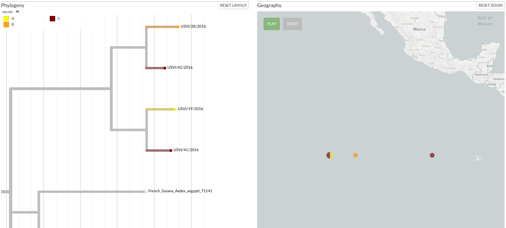

# Adding extra metadata via CSV/TSV

A common use case is to have additional metadata which you would like to add to the current dataset.
If you created the dataset itself, then you may wish to keep certain data out of the dataset, as it may change frequently or be sensitive information which you don't want to share publicly.

Additional metadata (CSV / TSV file(s)) can be dragged onto an existing dataset in Auspice.
These extra data are processed within the browser, so no information leaves the client, which can be useful for viewing private metadata.

The general format is compatable with other popular tools such as [MicroReact](https://microreact.org/).
The first column defines the names of the strains / samples in the tree, while the first row (header row) defines the metadata names.
The separator can be either a tab character or a comma & the file extension should be `.tsv` or `.csv`, respectively.
You can add as many columns you want, each will result in a different coloring of the data being made available

## Example:

A TSV file as follows can be dragged onto [nextstrain.org/zika](https://nextstrain.org/zika) to add a "secret" color-by:

```text
strain	secret
USVI/19/2016	A
USVI/28/2016	B
USVI/41/2016	C
USVI/42/2016	C
```


A more complex metadata file may look like the following, which makes use of additional features available.
This defines colours for the metadata (e.g. `A` is yellow, `B` is orange) as well as associating strains with (made up) geographic coordinates.

```text
strain	secret	secret__colour	latitude	longitude
USVI/19/2016	A	#f4e409	0	-120
USVI/28/2016	B	#f49015	0	-115
USVI/41/2016	C	#710000	0	-100
USVI/42/2016	C	#710000	0	-120
```




## Adding extra colorings and filters

Most metadata columns will be added as colorings; once the data has been added they should appear as new entries in the "Color By" dropdown (Left-hand sidebar of Auspice).
This means you can also filter by these tratis using the "Filter Data" box.

An extra coloring is automatically created to represent the set of samples which were in the CSV/TSV file -- this allows you to easily filter the dataset to just those samples which you had in your metadata file.

You can choose the colours you want to associate with values by adding in a separate column with the same name + `__colour` (see above exapmle).
Currently the values in this column must be hex values such as `#3498db` (blue).
If the same value of metadata is associated with multiple, distinct, colours then the colours are blended together.

## Adding geographic locations

If the columns `latitude` and `longitude` exist (or `__latitude` and `__longitude`) then we will add a new geographic resolution to the dataset representing this.
Any additional metadata of this format defines lat-longs _per-sample_, which is different to Nextstrain's approach (where we associate a location to a metadata trait).
To resolve this, we create a new (dummy) trait whose values represent the unique lat/longs provided.
In the above example screenshot, note that auspice groups `USVI/19/2016` and `USVI/42/2016` together on the map as their lat/longs are identical; the other metadata columns (e.g. `secret`) are irrelevent in this case.


Note that if the dataset itself doesn't contain any geographic data, then adding metadata will trigger the map to be displayed.


## Privacy

All data added via these additional metadata files remains in-browser, and doesn't leave your computer.
This makes it safe for sensitive data.

## Schema

The following fields are ignored completely.
(Some of these may be allowed in the future when we have increased the features available here.)

```yaml
name
div
vaccine
labels
hidden
mutations
url
authors
accession
traits
children
date
num_date
year
month
day
```

Fields which end with certain strings are treated as follows:
- `__autocolour`: this suffix is dropped, but the column is otherwise parsed as normal
- `__colour`: see above section on adding colours
- `__shape`: this column is currently ignored


The following columns are interpreded as geographic locations (see section above) and therefore are not added as a coloring:
```yaml
__latitude
__longitude
latitude
longitude
```

The name of the first column is not used, but the first column is always taken to be the sample (strain) name.

## Scale types
The type of the data is currently always categorical.
This means that while numeric data will work, it won't be very usable if there are many values.

